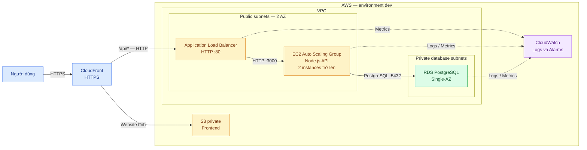

# Kiến trúc hiện tại

## Sơ đồ tổng thể

## Lưu ý đúng với cấu hình hiện tại

- CloudFront đang dùng hostname mặc định `*.cloudfront.net` và certificate mặc định của CloudFront.
- CloudFront → ALB đang dùng HTTP; ALB lắng nghe port `80`.
- ALB → EC2 dùng HTTP port `3000`; EC2 → RDS dùng PostgreSQL port `5432`.
- EC2 nằm trong public subnets; RDS nằm trong private database subnets và hiện là Single-AZ.
- Đây là sơ đồ khái niệm phục vụ thuyết trình; xem [sơ đồ chi tiết](../components/README.md) khi cần security groups, Internet Gateway và module wiring.

## Mapping với Terraform modules

| Thành phần | Module |
|---|---|
| VPC và subnets | [`network`](../../modules/network) |
| Frontend và CloudFront | [`frontend`](../../modules/frontend) |
| ALB | [`alb`](../../modules/alb) |
| EC2 Auto Scaling Group | [`compute`](../../modules/compute) |
| RDS PostgreSQL | [`database`](../../modules/database) |
| Logs và alarms | [`monitoring`](../../modules/monitoring) |
