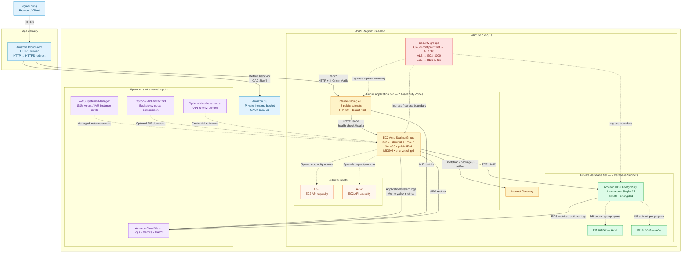

# Thành phần hạ tầng

> Đây là sơ đồ kiến trúc theo cấu hình Terraform hiện tại. Sơ đồ mô tả topology và luồng truy cập; không khẳng định tài nguyên đã được `apply` trên AWS.

## Sơ đồ kiến trúc tổng thể



Ghi chú: kiến trúc hiện tại không dùng NAT Gateway. EC2 API chạy trong public subnet và có public IPv4 để bootstrap/outbound qua Internet Gateway, nhưng application port `3000` không mở trực tiếp ra Internet. RDS có DB subnet group trải trên hai AZ nhưng chỉ chạy một instance Single-AZ. Viewer hiện tại dùng hostname mặc định `*.cloudfront.net`; custom viewer domain và certificate `us-east-1` là cải tiến tương lai.

## Cây tài liệu

```text
docs/
├── architecture/
│   └── README.md                 # Sơ đồ rút gọn dùng cho thuyết trình
├── components/
│   └── README.md                 # Kiến trúc và các luồng tổng thể
└── configuration/
    ├── README.md                 # Thứ tự cấu hình và quan hệ module
    ├── network/README.md
    ├── security-groups/README.md
    ├── certificates/README.md
    ├── alb/README.md
    ├── frontend/README.md
    ├── database/README.md
    ├── monitoring/README.md
    └── compute/README.md
```

## Danh mục module

| Module | Mục tiêu |
|---|---|
| [`network`](../configuration/network/README.md) | VPC, hai public subnets, hai database subnets, Internet Gateway và định tuyến. |
| [`security-groups`](../configuration/security-groups/README.md) | Chuỗi truy cập CloudFront → ALB → application → database. |
| [`certificates`](../configuration/certificates/README.md) | Certificate reusable cho environment production HTTPS; không dùng trong dev hiện tại. |
| [`alb`](../configuration/alb/README.md) | Public ALB, API target group, listener và kiểm tra custom origin header. |
| [`frontend`](../configuration/frontend/README.md) | S3 private, OAC, CloudFront distribution và API behavior `/api/*`. |
| [`database`](../configuration/database/README.md) | DB subnet group, một RDS Single-AZ và RDS engine logs. |
| [`monitoring`](../configuration/monitoring/README.md) | CloudWatch log groups, metric filters, alarms cho ALB/ASG/RDS/API. |
| [`compute`](../configuration/compute/README.md) | IAM, launch template, EC2 Auto Scaling Group và CPU target tracking. |

## Luồng mạng và kiểm soát truy cập

| Luồng | Nguồn → đích | Cấu hình mục tiêu |
|---|---|---|
| Frontend tĩnh | Viewer → CloudFront → S3 | OAC và bucket policy; S3 không public. |
| API công khai | Viewer `*.cloudfront.net` → CloudFront → ALB | Behavior `/api/*`; CloudFront gửi custom origin header và dev kết nối tới ALB bằng HTTP. |
| Vào ALB | CloudFront prefix list → ALB SG | Chỉ managed prefix list origin-facing của CloudFront được vào listener. |
| Tới application | ALB SG → application SG | Chỉ application port được phép. |
| Tới database | Application SG → database SG | Chỉ DB port được phép. |
| Outbound application | EC2 public subnet → IGW | Bootstrap, tải package/artifact; không có NAT Gateway. |

## Domain và certificate độc lập

- **Viewer domain:** giai đoạn hiện tại là `https://<distribution>.cloudfront.net`, dùng certificate mặc định của CloudFront. Không cần mua domain riêng, Route 53 hosted zone, CloudFront alias hoặc ACM certificate `us-east-1` cho luồng này.
- **ALB origin:** dev dùng trực tiếp DNS name AWS cấp cho ALB, không cần domain riêng hoặc certificate regional.
- **HTTPS origin:** là cải tiến dành cho environment production; khi bật cần domain public, DNS và certificate regional khớp origin.

## Quyết định cần chốt trước khi triển khai

- CIDR VPC, hai Availability Zones và dải CIDR của từng loại subnet.
- Dev/test dùng HTTP origin và ALB DNS name AWS cấp; production HTTPS origin, domain và certificate là phạm vi riêng cần chốt sau.
- AMI, instance type, dung lượng ASG, artifact khởi chạy API và nơi lưu secret database.
- Engine/version/class/storage, backup, maintenance và deletion protection của RDS.
- Ngưỡng alarm, kênh nhận cảnh báo và retention của log.
- Custom viewer domain, CloudFront alias và certificate `us-east-1` chỉ là quyết định tương lai, không phải điều kiện của URL mặc định.

Xem thứ tự wiring và các contract input/output tại [kế hoạch cấu hình](../configuration/README.md).
